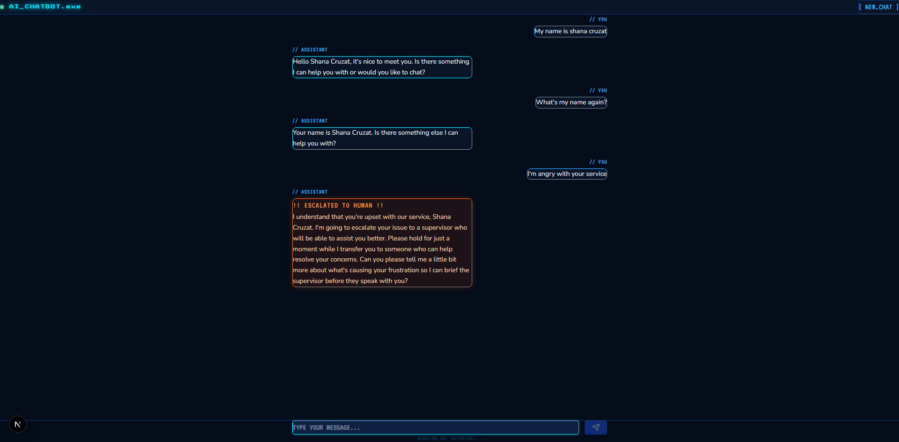

# AI Chatbot with Memory and Escalation

An AI-powered chatbot that remembers past messages within 
a session and automatically escalates to a human agent 
when it detects urgent or sensitive issues. 

## Demo


## How it works
1. User starts a new chat session
2. Every message is saved to Supabase with a session ID
3. On each new message the backend fetches all past 
   messages and sends them to Groq AI
4. AI reads the full conversation history before answering
5. If the message triggers escalation the AI responds 
   with an orange escalation alert
6. All messages are stored permanently in Supabase

## Tech stack
| Layer | Technology |
|---|---|
| Frontend | Next.js, TypeScript, Tailwind CSS |
| Backend | FastAPI, Python |
| AI | Groq API (Llama 3.3 70b) |
| Database | Supabase |
| Deploy | Vercel (frontend), Render (backend) |

## Key features
- Conversation memory — AI remembers everything said 
  in the current session
- Escalation detection — automatically flags urgent 
  issues and hands off to a human
- Session tracking — each conversation has a unique 
  session ID stored in Supabase

## What I learned
- The AI itself has zero memory — the backend is 
  responsible for fetching and sending past messages 
  to Groq on every request
- How to build a conversation memory system using 
  Supabase to store and retrieve message history
- Why escalation logic matters in real world chatbots — 
  AI should know its limits and hand off to humans
- How careful prompt engineering affects AI behavior — 
  small changes in the system message dramatically 
  change how the AI responds and escalates
- How session IDs link conversations to their messages 
  in a relational database

## Challenges and solutions
- Session ID management — making sure each conversation 
  is correctly linked to its messages in Supabase → 
  solved by creating a conversations table and passing 
  the conversation ID with every message request
- Escalation prompt tuning — AI was giving long 
  explanations instead of short escalation reasons → 
  fixed by being more specific in the system message 
  instructions


## Future improvements
- Show past conversation history so users can 
  revisit previous sessions
- Send an automated email to a human agent when 
  escalation is triggered
- Allow customizable AI persona for different 
  business use cases such as customer service, 
  HR support, or technical helpdesk
- Add typing indicators and streaming responses

## Local setup

### Backend
```bash
cd backend
python -m venv venv
venv\Scripts\activate
pip install -r requirements.txt
uvicorn main:app --reload
```

### Frontend
```bash
cd frontend
npm install
npm run dev
```

## Environment variables
Create a `.env` file in the root folder:
```bash
SUPABASE_URL=your_supabase_url_here
SUPABASE_KEY=your_supabase_key_here
GROQ_API_KEY=your_groq_key_here
```

## Author
Shana Cruzat 
